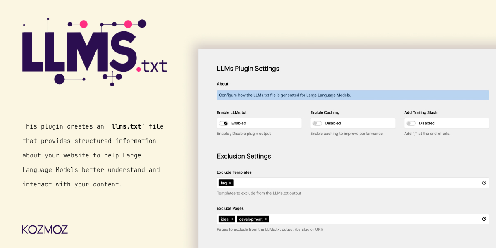

# Kozmoz Kirby LLMs Plugin

A Kirby CMS plugin that generates an `llms.txt` file in the root of your website or responds to the `llms.txt` route with necessary information for Large Language Models (LLMs).



## Overview

This plugin creates an `llms.txt` file that provides structured information about your website to help Large Language Models better understand and interact with your content. Similar to how `robots.txt` works for search engines, `llms.txt` provides guidance for LLMs.

## Features

- Generates an `llms.txt` file in the root of your website in Markdown format
- Generates an XML sitemap at `sitemap.xml` using the same page filtering as LLMs.txt
- Provides dedicated routes to access both LLMs information and sitemap
- Creates proper Markdown links for pages with trailing slashes (configurable)
- Strips HTML tags from descriptions and metadata for clean output
- Configurable exclusion of pages and templates
- Automatic cache clearing when content changes
- Supports configuration via your site's main config.php file
- Panel integration for easy configuration through the Kirby admin interface

## Installation

### Manual Installation

1. Download or clone this repository
2. Place the folder `kirby-llms` in your `site/plugins` directory
3. Rename the folder to `kirby-llms` if needed

### Composer Installation

```bash
composer require kozmozio/kirby-llms
```

## Configuration

### Via Config File

You can configure the plugin by adding options to your `config.php` file:

```php
return [
  'kozmozio.llms' => [
    'enabled' => true,
    'cache' => true,
    'cache.duration' => 60, // minutes
    'add_trailing_slash' => true, // Whether to add trailing slashes to URLs
    'sitemap_enabled' => true, // Enable XML sitemap generation
    'exclude' => [
      'templates' => ['error', 'faq', 'faqs', 'faqpage', 'faq-page'],
      'pages' => ['faqs', 'private-page', 'another-page']
    ]
  ]
];
```

### Via Kirby Panel

The plugin also provides a panel interface for configuring the settings. To enable this, you need to add the LLMs tab to your site blueprint.

1. Add the LLMs tab to your `site.yml` blueprint:

```yaml
# site.yml
title: Site
unlisted: true

tabs:
  # Your existing tabs...
  
  # LLMs settings tab
  llms:
    extends: tabs/llms
```

This will add a new "LLMs" tab to your site settings in the panel, where you can configure:
- Enable/disable the LLMs.txt generation
- Enable/disable the XML sitemap generation
- Enable/disable caching
- Set cache duration
- Enable/disable adding trailing slashes to URLs
- Exclude templates and pages

### Blueprint Structure

The plugin uses the following blueprint structure:

```
blueprints/
├── kozmoz/
│   └── llms-settings.yml  # The main settings section
├── tabs/
│   └── llms.yml           # The tab that extends the settings section
```

You can customize these blueprints by copying them to your site's blueprint directory and modifying them as needed:

```
site/
└── blueprints/
    ├── sections/
    │   └── llms-settings.yml  # Your customized settings
    └── tabs/
        └── llms.yml           # Your customized tab
```

### Configuration Options

| Option | Type | Default | Description |
|--------|------|---------|-------------|
| `enabled` | boolean | `true` | Enable or disable serving llms.txt |
| `sitemap_enabled` | boolean | `true` | Enable or disable XML sitemap generation |
| `cache` | boolean | `false` | Enable or disable caching |
| `cache.duration` | integer | `60` | Cache duration in minutes |
| `add_trailing_slash` | boolean | `true` | Whether to add trailing slashes to URLs in the output |
| `exclude.templates` | array | `['error', 'faq', 'faqs', 'faqpage', 'faq-page']` | Templates to exclude from the output |
| `exclude.pages` | array | `[]` | Pages to exclude from the output |

### Excluding Pages

You can exclude specific pages from the llms.txt output by adding their slugs to the `exclude.pages` array in your configuration. The plugin performs matching on:

- Exact page ID or URI match
- Pages with the same name in different locations (e.g., if you exclude 'inan-olcer', both 'inan-olcer' and 'team/inan-olcer' will be excluded)
- Child pages of excluded parents
- Pages with URIs containing specific strings (e.g., if you exclude 'faq', all pages with 'faq' in their URI will be excluded)

For example:
```php
'exclude' => [
  'pages' => ['about', 'blog/private-post', 'team-member', 'faqs']
]
```

## Usage

Once installed, the plugin automatically sets up two routes:

- `yourdomain.com/llms.txt` - Generates the LLMs information in Markdown format
- `yourdomain.com/sitemap.xml` - Generates an XML sitemap using the same page filtering

The LLMs content will be in Markdown format with proper Markdown links for pages and their descriptions. The sitemap will be in standard XML format following the sitemap protocol. All HTML tags are automatically stripped from descriptions and metadata to ensure clean, plain text output.

### Automatic Cache Clearing

The plugin automatically clears its cache when:
- Pages are created, updated, or deleted
- Page properties change (status, slug, title, template)
- Site information is updated

This ensures that both the `llms.txt` content and `sitemap.xml` are always up-to-date with your website's content.

### Example Output

#### LLMs.txt Output

```markdown
# Your Website Title

> Your Website Title is your website description

Generated on: 2023-06-15 12:34:56

## Docs

- [Home](https://example.com/) - Welcome to our website
- [About Us](https://example.com/about/) - Learn more about our company and our mission
- [Products](https://example.com/products/) - Explore our range of products
- [Blog](https://example.com/blog/) - Read our latest articles
- [Contact](https://example.com/contact/) - Get in touch with us
```

#### Sitemap.xml Output

```xml
<?xml version="1.0" encoding="UTF-8"?>
<urlset xmlns="http://www.sitemaps.org/schemas/sitemap/0.9">
  <url>
    <loc>https://example.com/</loc>
    <lastmod>2023-06-15T12:34:56+00:00</lastmod>
    <changefreq>daily</changefreq>
    <priority>1.0</priority>
  </url>
  <url>
    <loc>https://example.com/about/</loc>
    <lastmod>2023-06-10T08:20:15+00:00</lastmod>
    <changefreq>weekly</changefreq>
    <priority>0.8</priority>
  </url>
  <url>
    <loc>https://example.com/products/</loc>
    <lastmod>2023-06-12T14:45:30+00:00</lastmod>
    <changefreq>weekly</changefreq>
    <priority>0.8</priority>
  </url>
</urlset>
```

## Static Site Generation

If you're using a static site generator with Kirby, make sure to include both routes in your static routes:

```php
array_push($staticRoutes, [
  'path' => 'llms.txt', 
  'route' => 'llms.txt'
]);

array_push($staticRoutes, [
  'path' => 'sitemap.xml', 
  'route' => 'sitemap.xml'
]);
```

## Development Status

### Phase 1: Basic Structure and Setup ✓

1. Create plugin folder structure ✓
2. Set up plugin initialization ✓
3. Register the route for `llms.txt` ✓
4. Implement basic configuration options ✓

### Phase 2: Core Functionality ✓

1. Develop the content generator for `llms.txt` ✓
2. Implement page collection and filtering ✓
3. Create the response formatter ✓
4. Add caching mechanism ✓

### Phase 3: Advanced Features ✓

1. Add customization options for content exclusion ✓
2. Implement metadata extraction ✓
3. Add automatic cache clearing when content changes ✓
4. Strip HTML tags from descriptions and metadata ✓
5. Ensure URLs have trailing slashes ✓

### Phase 4: Testing and Documentation ✓

1. Test with different Kirby setups ✓
2. Create comprehensive documentation ✓
3. Add examples and use cases ✓
4. Prepare for release ✓

## Author

[Inan Olcer Kozmoz](https://kozmoz.io)


## License

MIT
